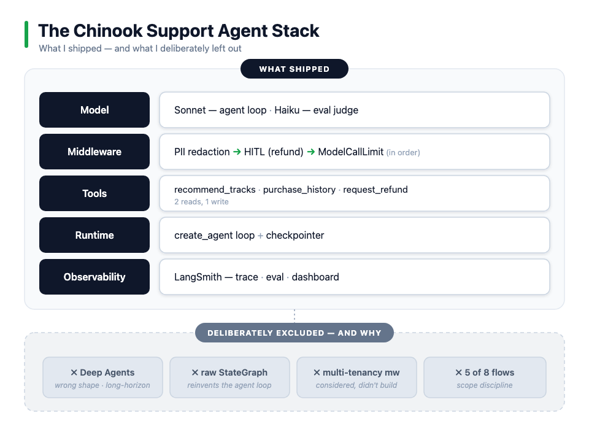

# Chinook customer-support agent

A production-patterned customer-support agent over the [Chinook](https://github.com/lerocha/chinook-database) sample database (a digital music store). Three flows — music recommendations, purchase history, and refunds — built with LangChain `create_agent` (the agent + middleware), LangGraph (durable state and human-in-the-loop), and LangSmith (the evaluation flywheel).

It's a **proof-of-concept built on production patterns**, not a deployed system — the patterns are the point.

> **Full write-up:** the architecture decisions, the business framing, and the eval flywheel are walked through in the case study → **[Camille's Refund: A Case Study in Production-Grade Agent Engineering](https://medium.com/@jshahid812/camilles-refund-a-case-study-in-production-grade-agent-engineering-6ead23180bde)**. This README is the "how to run it"; the blog is the "why it's built this way."

## Architecture at a glance



- One `create_agent` loop — **3 tools** (2 reads, 1 write) and **3 middleware**.
- **Tools:** `recommend_tracks`, `get_my_recent_purchases`, `request_refund`.
- **Middleware (in order):** PII redaction → human-in-the-loop on refunds → `ModelCallLimit` (cost-runaway cap).
- **Multi-tenancy:** `customer_id` is injected from runtime context at the API boundary, never read from chat; parameterized SQL throughout; read-only DB connection.
- **Evaluation:** an offline dataset scored by LLM-as-judge on routing / keywords / groundedness, with the same judges running online against live traces.

**Deliberately left out** (reasoning in the case study): Deep Agents, a raw `StateGraph`, a custom multi-tenancy middleware, and 5 of 8 candidate flows. Knowing what *not* to build was part of the design.

## Run it

Prereqs: Python 3.11+, an Anthropic API key, and a LangSmith API key.

```bash
pip install -r requirements.txt
```

Create a `.env`:

```
ANTHROPIC_API_KEY=...
LANGSMITH_API_KEY=...
LANGSMITH_TRACING=true
```

Then:

```bash
langgraph dev          # opens LangGraph Studio (graph: "agent")
# or
python agent.py        # runs with in-memory checkpointing; HITL works
```

Run the evals:

```bash
python eval/evaluators.py
```

## Layout

| Path | What's there |
|---|---|
| `agent.py` | The agent — tools, middleware, runtime context, checkpointer |
| `eval/dataset.py` | Evaluation dataset (the "what good looks like" baseline) |
| `eval/evaluators.py` | Offline + online judges (routing, keywords, groundedness) |
| `Chinook.db` / `chinook.sql` | Sample database |
| `langgraph.json` | Graph + env config |

## Scope & honesty

A focused build with production discipline as the goal — a POC on production patterns, not a deployed production system. Tradeoffs and lessons (including the middleware I considered and chose not to build) are in the case study.
